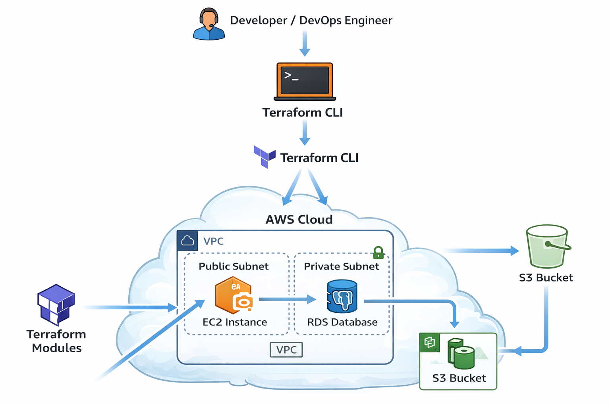
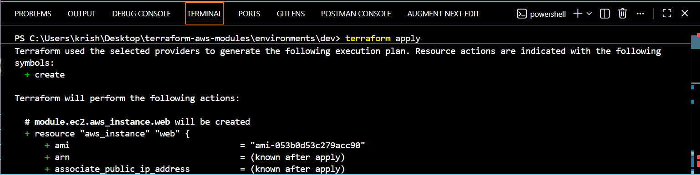

# 🚀 Terraform AWS Infrastructure Modules




This project demonstrates **Infrastructure as Code (IaC)** using **Terraform** to provision AWS infrastructure with a **modular architecture**.

The infrastructure includes networking, compute, storage, and database modules that can be reused across environments.

---

# 🌐 Infrastructure Overview

The project provisions AWS resources using reusable Terraform modules.

Provisioned components include:

- VPC networking
- Public and private subnets
- EC2 compute instance
- RDS database module
- S3 storage bucket

This project demonstrates how infrastructure can be **automated, version controlled, and deployed consistently using Terraform.**

---

## 📸 Infrastructure Preview

### Terraform Execution



Terraform successfully creating AWS resources using reusable modules.

---

### EC2 Instance


EC2 instance provisioned in the public subnet using Terraform.

---

# 🧰 Tech Stack

* Terraform
* AWS
* EC2
* RDS
* S3
* VPC
* Git
* GitHub

---

# 🏗 Architecture

The infrastructure follows a **modular Terraform architecture**.

### Infrastructure Flow


Terraform
↓
AWS Cloud Infrastructure
↓
VPC Network
├── Public Subnet
│ └── EC2 Instance
│
├── Private Subnet
│ └── RDS Database
│
└── S3 Bucket


### Architecture Components

**Terraform Modules**

Reusable modules are used to organize infrastructure code and promote maintainability.

**VPC**

Creates the network environment including subnets and routing.

**EC2 Instance**

Compute instance deployed in the public subnet.

**RDS Database**

Managed relational database deployed in the private subnet.

**S3 Bucket**

Object storage bucket for storing application or infrastructure data.

---

# 📂 Project Structure


terraform-aws-modules
│
├── modules
│ ├── vpc
│ ├── ec2
│ ├── rds
│ └── s3
│
├── environments
│ └── dev
│ ├── main.tf
│ ├── provider.tf
│ └── terraform.tfvars
│
├── assets
│ ├── architecture.png
│ ├── ec2.png
│ └── terraform-plan.png
│
├── .gitignore
└── README.md


---

# ⚙ Infrastructure Deployment

### 1️⃣ Initialize Terraform

```bash
terraform init
2️⃣ Preview Infrastructure Changes
terraform plan
3️⃣ Deploy Infrastructure
terraform apply

Terraform will create the AWS infrastructure defined in the Terraform modules.

4️⃣ Destroy Infrastructure
terraform destroy

This command removes all created AWS resources.

📊 Features

Modular Terraform architecture

Infrastructure as Code using Terraform

AWS cloud resource provisioning

Reusable Terraform modules

Version controlled infrastructure

Environment-based deployment structure

🔮 Future Improvements

Remote Terraform state using S3

State locking using DynamoDB

CI/CD pipeline for Terraform deployment

Multi-environment support (dev/staging/prod)

👩‍💻 Author

Krishna

GitHub
https://github.com/krishnash648

⭐ If you found this project useful, consider giving it a star.
